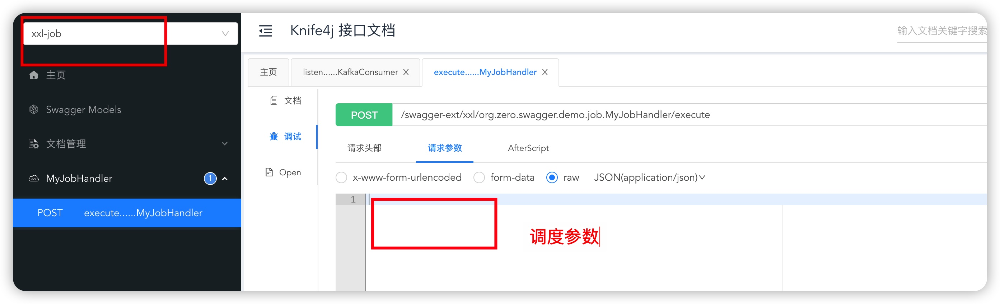
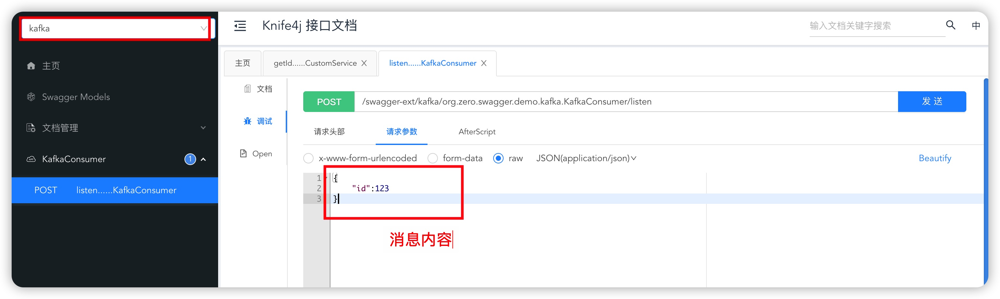
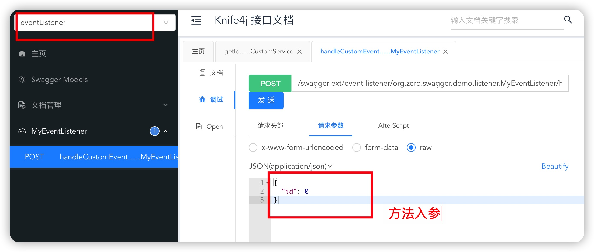
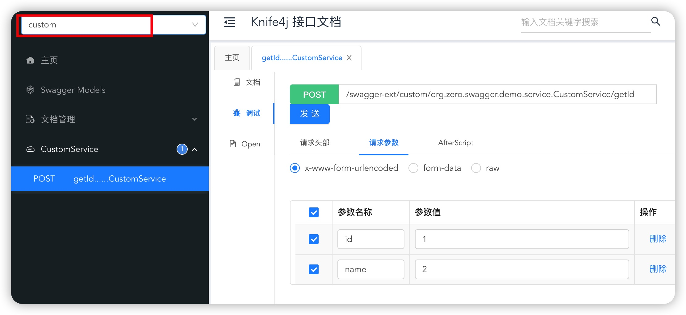

# Swagger增强服务文档

该文档是参考 : https://github.com/Sayi/swagger-dubbo 的dubbo文档开发的.

## 背景

### 本地测试问题

Swagger围绕着OpenAPI规范，提供了一套设计、构建、文档化rest api的开源工具。官方的swagger-ui仅能支持Http接口，对于像xxl-job，Kafka消费者等，并不支持。
以xxlj-job为例，如果我们要本地测试，一般是通过以下方式：

1. 本地启动xxl-job-admin，通过管理端界面来调度。
2. 写单元测试类，每次测试都需要启动spring容器。
3. 将测试环境的xxl-job-admin，固定调度到本机，测试完再将ip改回去（对于xxl-job-admin部署在容器的情况，这种情况还需要通过外网穿透）。

上面几个方法都可以实现，但是会相对麻烦点。

### 解决

通过swagger将定时任务映射出来，像测试http接口一样来测试定时任务，就可以很方便的进行本地测试。


## 如何使用

假设你的服务已经引入swagger，并能正常访问。

### 添加依赖

```xml
<dependency>
    <groupId>org.zero.swagger</groupId>
    <artifactId>swagger-ext</artifactId>
    <version>1.0-SNAPSHOT</version>
</dependency>

<!-- SpringDoc OpenAPI 3（与 Knife4j 4.5 兼容需 ≤2.3.x，2.4+ 将 getGroupConfigs 改为 Set 会报 NoSuchMethodError） -->
<dependency>
    <groupId>org.springdoc</groupId>
    <artifactId>springdoc-openapi-starter-webmvc-ui</artifactId>
    <version>2.3.0</version>
</dependency>
<!-- Knife4j 增强 UI，提供 doc.html -->
<dependency>
    <groupId>com.github.xiaoymin</groupId>
    <artifactId>knife4j-openapi3-jakarta-spring-boot-starter</artifactId>
    <version>4.5.0</version>
</dependency>
```

### 添加配置

```properties
# 参考 application.yml, 按需配置
```

### 使用

#### xxlj-job

将我们在xxl-job-admin上配置的参数放在requestBody，发送请求就可以。


#### kafka消费者

将消息体放在requestBody，发送请求就可以。



#### spring事件

事件内容放在requestBody就可以



#### 任意bean的方法

这里注意: 如果是方法请求参数有对象的话, 对象参数一定要放在最后一个.

